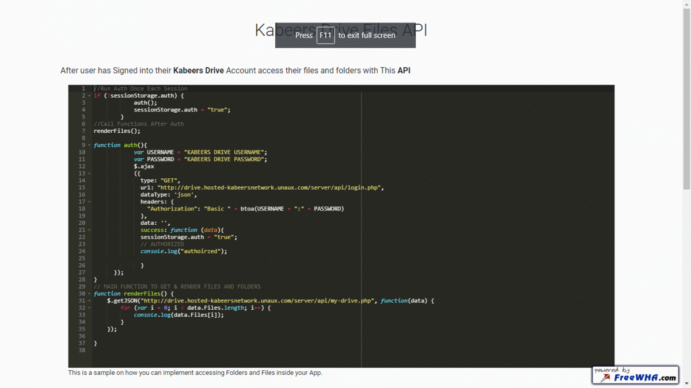

This is the Open Repo for: 
# Kabeers Drive V2

 
------------------------------------------
1) First Open the file named SQL and Run it on your PHP My Admin Database.
2) Then Open Config.php file and fill out the spaces.
3) chmod all files between 644 - 777 and folders between 755 - 777.
4) Now Just Go to yoursite.com/index.php
------------------------------------------
Done!

------------------------------------------
Some Interesting Facts!
1) Kabeers Drive is made of about 155 512 lines of code.
2) Kabeers Drive has around 1995 seprate files.
3) Even though it has so many files and folders and lines of code the compressed version is no bigger than 6.2 mb.

------------------------------------------
Designed and developed by <a href="https://github.com/kabeer11000">Kabeer Jaffri</a>.
------------------------------------------
Credits:

Bootstrap Material Design : FEDERICO ZIVOLO, https://fezvrasta.github.io/ . 
JQuery JS : OpenJs Foundation, https://jquery.com/ . 
Bootstrap & Jquery FancyBox Plugn: FancyBox, http://fancybox.net/ . 
Material Design Framework: Google, https://material.io/ . 
DragSelect JS: Thibault Jan Beyer, https://thibaultjanbeyer.github.io/DragSelect/ . 
Proper JS: ProperJS Org, https://popper.js.org/ . 
Materialize Framework: Alvin Wang, Kevin Louie, Alex Mark, Alan Chang, https://materializecss.com/ . 
Dropzone JS: Dropzone JS Foundation, https://www.dropzonejs.com/ . 
TinyFileManager : Tiny File Manger Owners , https://github.com/tinyfilemanager.  

------------------------------------------
Contact at kabeer11000@gmail.com if your name was not mentioned.
------------------------------------------
2020  Kabeers Network. All Rights Reserved
